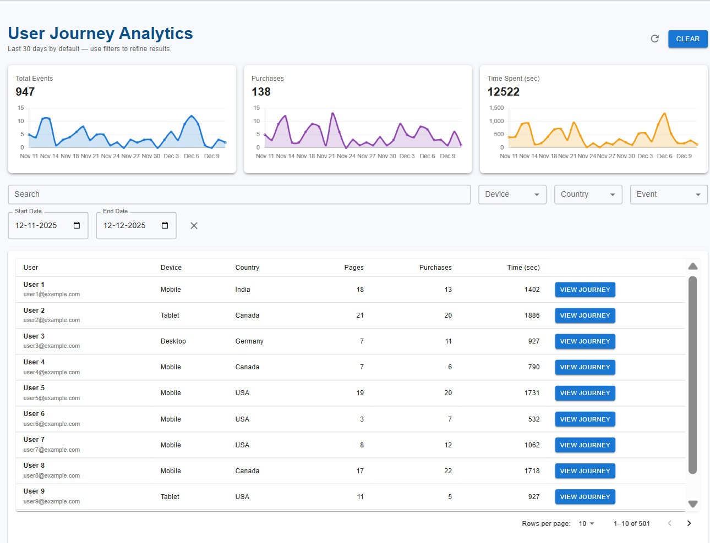

# User Journey Tracking Platform

## Project Overview & Problem Statement
This project implements a **User Journey Tracking & Analytics Platform** similar to large-scale e-commerce systems (e.g., Amazon).
The goal is to **ingest, process, and analyze millions of user interaction events per day** and provide actionable insights through dashboards, user journeys, and funnel analysis.

The system enables:
- Tracking user sessions and events (page visits, session time, cart actions, purchases, etc.)
- Analyzing behavior over time and across devices/countries
- Visualizing KPIs, funnels, and individual user journeys
- Designing for scalability, reliability, and observability

This project was built as part of a **senior-level system design & implementation assessment**.

---

## Levels Covered (Assessment Mapping)
| Area | Level Achieved |
|-----|---------------|
| Database Design | **L2** |
| Backend / APIs | **L3** |
| Frontend (React + Charts) | **L4** |
| Cloud / DevOps | **L1** |

---

## Key Challenges & High-Level Approach

### Challenge: Handling Millions of Events per Day
- Designed **append-only event ingestion**
- Indexed MongoDB collections by **userId, sessionId, timestamp**
- Aggregated analytics via **MongoDB aggregation pipelines**
- Paginated dashboards to avoid heavy payloads

### Challenge: Analytics Without Slowing Ingestion
- Read-heavy analytics isolated from write-heavy ingestion
- Time-window queries optimized via compound indexes
- Designed for future streaming (Kafka/Kinesis-ready)

---

## High-Level Architecture


**Frontend**
- React + TypeScript
- Material UI
- Chart.js for analytics
- RTK Query-ready API layer

**Backend**
- Node.js + Express + TypeScript
- Layered architecture (Controller → Service → Model)
- REST APIs for dashboard, journey, funnel

**Database**
- MongoDB Atlas
- Collections: users, sessions, events

**Cloud (Design)**
- AWS ALB → EC2 (API)
- MongoDB Atlas (Managed)
- CloudWatch for logs, metrics & dashboards

---

## System Diagram
> Embedded in README via draw.io export
**Flow**
Frontend → ALB → Node.js API → MongoDB Atlas  
Logs/Metrics → CloudWatch → Grafana

---

## Database Design

### Main Collections

#### users
```json
{
  "_id": ObjectId,
  "name": "User 1",
  "email": "user1@example.com",
  "device": "Mobile",
  "country": "India",
  "createdAt": Date
}
```

#### sessions
```json
{
  "_id": ObjectId,
  "userId": ObjectId,
  "sessionStart": Date,
  "sessionEnd": Date,
  "eventCount": Number
}
```

#### events
```json
{
  "_id": ObjectId,
  "userId": ObjectId,
  "sessionId": ObjectId,
  "eventType": "page_visit | purchase | add_to_cart",
  "timestamp": Date,
  "durationSec": Number
}
```

### Indexing Strategy
Here we focus on the three most critical collections:

1. Users  
2. Sessions  
3. Events  

The objective is to support **high write throughput**, **low-latency analytics**, and **scalability to millions of events per day**, while keeping MongoDB costs and operational complexity under control.

---

#### 1️⃣ Users Collection (`users`)

### Purpose
The `users` collection stores core user profile and metadata.  
It is primarily accessed for:
- Authentication (login)
- Dashboard search and filters
- Enriching session and event analytics with user attributes

##### Schema (Simplified)
```ts
{
  _id: ObjectId,
  name: string,
  email: string,
  device: string,
  country: string,
  createdAt: Date
}
```

##### Indexes
```ts
{ email: 1 }                  // unique
{ device: 1 }
{ country: 1 }
{ name: "text", email: "text" }
```

##### Rationale
- Unique index on `email` enables fast authentication
- Device and country indexes optimize dashboard filtering
- Text index supports case-insensitive search

---

#### 2️⃣ Sessions Collection (`sessions`)

##### Purpose
Represents grouped user activity over time.

##### Schema (Simplified)
```ts
{
  _id: ObjectId,
  userId: ObjectId,
  sessionStart: Date,
  sessionEnd: Date,
  eventCount: number
}
```

##### Indexes
```ts
{ userId: 1, sessionStart: -1 }
{ sessionStart: -1 }
```

##### Rationale
- Compound index optimizes per-user session lookups
- Time-based index supports KPI calculations

---

#### 3️⃣ Events Collection (`events`)

##### Purpose
Core analytics data source powering dashboards, funnels, and journeys.

##### Schema (Simplified)
```ts
{
  _id: ObjectId,
  userId: ObjectId,
  sessionId: ObjectId,
  eventType: string,
  timestamp: Date,
  durationSec: number,
  device: string,
  country: string
}
```

##### Indexes
```ts
{ userId: 1, timestamp: -1 }
{ sessionId: 1, timestamp: 1 }
{ eventType: 1, timestamp: -1 }
{ device: 1 }
{ country: 1 }
```

##### Rationale
- Optimized for time-based analytics and user journeys
- Supports funnel and conversion analysis efficiently

---

## 🔌 Backend API Documentation

### Base URLs
- Local: `http://localhost:4000/api`

### Core Endpoints

#### Dashboard Analytics
```
GET /dashboard
```

Query Params:
- `start`, `end`
- `device`, `country`
- `q` (search)
- `page`, `limit`

Response includes:
- KPIs
- Paginated users
- Trend data

---

#### User Journey
```
GET /users/:id/journey
```

Returns:
- User profile
- Session-wise events
- KPIs
- Event trend

---

#### Funnel Analysis
```
GET /funnel
```

Returns:
- Funnel stages with conversion %
- Timeline breakdown per event

---

## Frontend Design
### Wireframe
1. **Login**


2. **Dashboard**


3. **User Journey**


4. **Funnel Analysis**


### Main Views
1. **Login**

2. **Dashboard**
   - Search, filters, date range
   - KPIs
   - Trend graphs
   - Paginated user table

3. **User Journey**
   - Session timelines
   - Event trends

4. **Funnel Analysis**
   - Conversion funnel
   - Timeline chart


### User Stories
- As an analyst, I want to see top KPIs quickly
- As a PM, I want to understand conversion drop-offs
- As a developer, I want to trace a user’s full journey

---

## Monitoring & Observability

### Metrics Collected
- API latency
- Request rate
- Error rate
- Event ingestion volume

### Tools
- **AWS CloudWatch**: logs, metrics & dashboards

---

## Scalability

Designed to handle **millions of events/day**:
- Horizontal API scaling behind ALB
- MongoDB sharding by userId (future)
- Read/write separation
- Async ingestion (Kafka/Kinesis-ready)
- Pre-aggregations for heavy dashboards

---

## Installation & Local Setup

### Prerequisites
- Node.js 18+
- MongoDB Atlas URI
- npm

### Backend
```bash
cd backend
npm install
npm run dev
```

### Frontend
```bash
cd frontend
npm install
npm run dev
```

### Environment Variables
```
MONGO_URI=
JWT_SECRET=
PORT=4000
```

---

## Deployment (Design)
- AWS EC2 for API
- ALB for routing
- MongoDB Atlas
- GitHub Actions (CI-ready)

---

## Design Decisions & Patterns
- Layered architecture
- Service abstraction
- DTO-style responses
- Pagination-first APIs
- Index-driven query design

---

## Repository Structure
```
/backend
  /models
  /services
  /routes
/frontend
  /pages
  /components
  /services
/docs
```